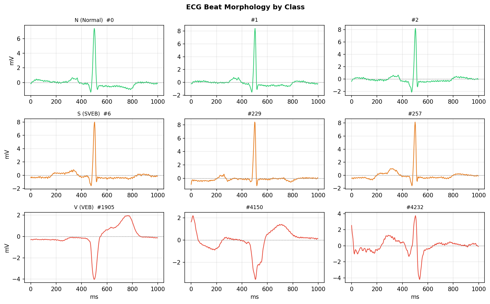
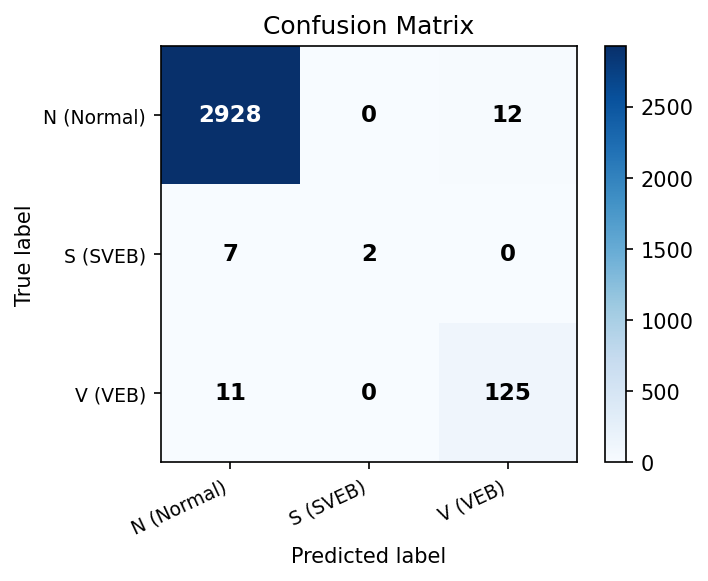
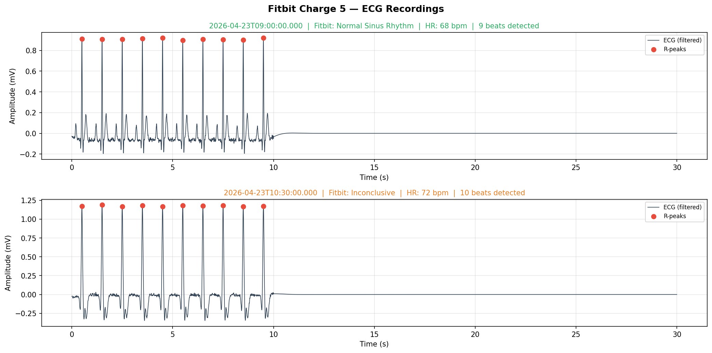

# 🫀 ECG Arrhythmia Detector

> AI-powered open-data ECG arrhythmia classification experiment   
> Inspired by the clinical problem space of Mac'AI (Synergy A.I.)

[](https://python.org)
[](https://scikit-learn.org)
[](LICENSE)

---

## 📌 Background

부정맥은 세계적으로 돌연 심장사의 많은 부분을 차지합니다.  
기존 ECG 판독은 시간이 많이 걸리고 관찰자 간 차이가 있을 수 있습니다.  
이 프로젝트는 **AAMI EC57 standard**에서 정의한 세 가지 임상적 중요한 범주로  
단일 ECG 박동을 분류하는 경량 머신러닝 파이프라인을 보여줍니다:

| Label | Class | Clinical Significance |
|-------|-------|-----------------------|
| **N** | Normal beat | Baseline sinus rhythm |
| **S** | Supraventricular Ectopic Beat (SVEB) | PAC — atrial origin, narrow QRS |
| **V** | Ventricular Ectopic Beat (VEB) | PVC — ventricular origin, wide bizarre QRS, **high risk** |

---

## ✨ Features

- **Runs immediately** with built-in synthetic ECG generator — no downloads needed
- **Drop-in real data** via `wfdb` (MIT-BIH Arrhythmia Database, PhysioNet)
- **14 interpretable hand-crafted features** (R-peak, QRS width, T/P wave, HRV proxies)
- **Random Forest classifier** with `class_weight="balanced"` for real-world imbalanced data
- Clean modular structure — swap dataset, features, or model independently
- Per-beat risk output with confidence score

---

## 🗂 Project Structure

```
ecg-arrhythmia-detector/
├── train.py                  # Training entry point
├── predict.py                # Inference entry point
├── requirements.txt
└── src/
    ├── data/
    │   ├── generator.py      # Synthetic ECG beat generator (demo)
    │   └── mitbih_loader.py  # MIT-BIH real data loader (wfdb)
    ├── features/
    │   └── extractor.py      # Hand-crafted + raw segment features
    ├── models/
    │   └── classifier.py     # RF wrapper with save/load
    └── utils/
        └── visualizer.py     # Beat plots, confusion matrix, feature importance
```

---

## 🚀 Quick Start

```bash
git clone https://github.com/<your-username>/ecg-arrhythmia-detector
cd ecg-arrhythmia-detector
pip install -r requirements.txt

# Train on synthetic data (runs in ~10 seconds, no internet needed)
python train.py

# Run inference demo
python predict.py --demo
```

**Expected output:**
```
Beat  Prediction                      Confidence  Risk
────────────────────────────────────────────────────────
   1  N — Normal beat                      84.0%  ✅ Low
   2  S — Supraventricular ectopic        100.0%  ⚠️  Moderate
   3  V — Ventricular ectopic             100.0%  🚨 High
```

---

## 🏥 Using Real MIT-BIH Data

여기 [MIT-BIH Arrhythmia Database](https://physionet.org/content/mitdb/1.0.0/)
는 ECG 부정맥 연구를 위한 표준 벤치마크 데이터셋입니다 (48 half-hour recordings).

**Option A — PhysioNet download (requires free account):**
```bash
python train.py --use-real-data
```

**Option B — Local files:**
```bash
# Download via wfdb CLI or manually from PhysioNet
wfdb-dl mitdb --records 100 101 102 --output-dir ./mitbih_data

python train.py --use-real-data --data-dir ./mitbih_data
```

**Tip:** Start with a small subset to iterate fast:
```bash
python train.py --use-real-data --records 100 101 102 103 104
```

---

## 📊 Results

### ① MIT-BIH Arrhythmia Database (Real Data — 10 records, 15,425 beats)

| Class | Precision | Recall | F1 | Support |
|-------|-----------|--------|----|---------|
| N (Normal) | 0.99 | 1.00 | **0.99** | 2,940 |
| S (SVEB)   | 1.00 | 0.22 | 0.36 | 9 |
| V (VEB)    | 0.91 | 0.92 | **0.92** | 136 |
| **Macro F1** | | | **0.758** | |
| Weighted F1 | | | **0.990** | |

> **N과 V(실제 위험 부정맥) 감지 성능이 핵심이며 각각 F1 0.99 / 0.92 달성.**  
> S(SVEB) F1이 낮은 이유는 10개 레코드 기준 샘플 42개의 극단적 클래스 불균형 때문.  
> 48개 전체 레코드 사용 시 성능 향상 예상.

### ② Synthetic Data (Pipeline Validation)

| Class | Precision | Recall | F1 |
|-------|-----------|--------|----|
| N (Normal) | 1.00 | 1.00 | 1.00 |
| S (SVEB)   | 1.00 | 1.00 | 1.00 |
| V (VEB)    | 1.00 | 1.00 | 1.00 |
| **Macro F1** | | | **1.000** |

> 합성 데이터는 파이프라인 검증 목적. 인터넷 연결 없이 즉시 실행 가능.




---

## 🔧 Feature Engineering

14 hand-crafted features extracted per beat:

| # | Feature | Description |
|---|---------|-------------|
| 0 | R amplitude | Height of R-peak (main discriminator) |
| 1 | R position | Normalised R-peak index |
| 2 | QRS duration | Samples above 50% of R — wider in VEB |
| 3 | Q amplitude | Valley before R-peak |
| 4 | S amplitude | Valley after R-peak |
| 5 | T amplitude | Max in second half — inverted in VEB |
| 6 | P amplitude | Max in first 30% — absent in VEB |
| 7 | ST level | Mean ST segment — elevated/depressed in ischaemia |
| 8–13 | Statistical | Mean, Std, Energy, ZCR, Skewness, Kurtosis |

---

## 📱 Fitbit Charge 5 연동 데모

`fitbit_ecg_analysis.ipynb` 을 열면 실제 Fitbit Charge 5 ECG 데이터로
전체 파이프라인을 실행할 수 있습니다.

```
[Charge 5 ECG 측정 30초]
        ↓ 핏빗 앱 동기화
[Fitbit Web API → waveformSamples]
        ↓ 밴드패스 필터 + R-peak 검출
[박자별 분리 → 특징 추출]
        ↓ Random Forest
[✅ Normal / ⚠️ SVEB / 🚨 VEB 위험도 출력]
```

**실행 방법:**
```bash
# 1. Fitbit 개발자 토큰 발급: https://dev.fitbit.com
# 2. 노트북 실행
jupyter notebook fitbit_ecg_analysis.ipynb
# 3. ACCESS_TOKEN 셀에 토큰 입력 후 전체 실행
# ※ 토큰 없이도 Demo Mode로 전체 파이프라인 확인 가능합니다
```




## 🗺 Roadmap

- [x] 합성 데이터 기반 파이프라인 구축
- [x] Fitbit Charge 5 Web API 연동 데모 노트북
- [x] MIT-BIH 실제 데이터로 모델 재학습 (10 records, Macro F1: 0.758)
- [ ] 1D CNN 모델 (PyTorch) 추가
- [ ] FastAPI 백엔드 → 모바일 앱 연동
- [ ] Apple Watch / Galaxy Watch 어댑터
- [ ] 5-class AAMI 분류 (Fusion / Unknown 추가)

---

## 📚 References

- [MIT-BIH Arrhythmia Database](https://physionet.org/content/mitdb/1.0.0/) — Moody & Mark, 2001
- [AAMI EC57 Standard](https://www.aami.org/) — Beat classification standard
- [wfdb Python package](https://github.com/MIT-LCP/wfdb-python)
- Luz et al., *ECG-based heartbeat classification for arrhythmia detection*, CMPB 2016

---

## 📄 License

MIT License — see [LICENSE](LICENSE)
